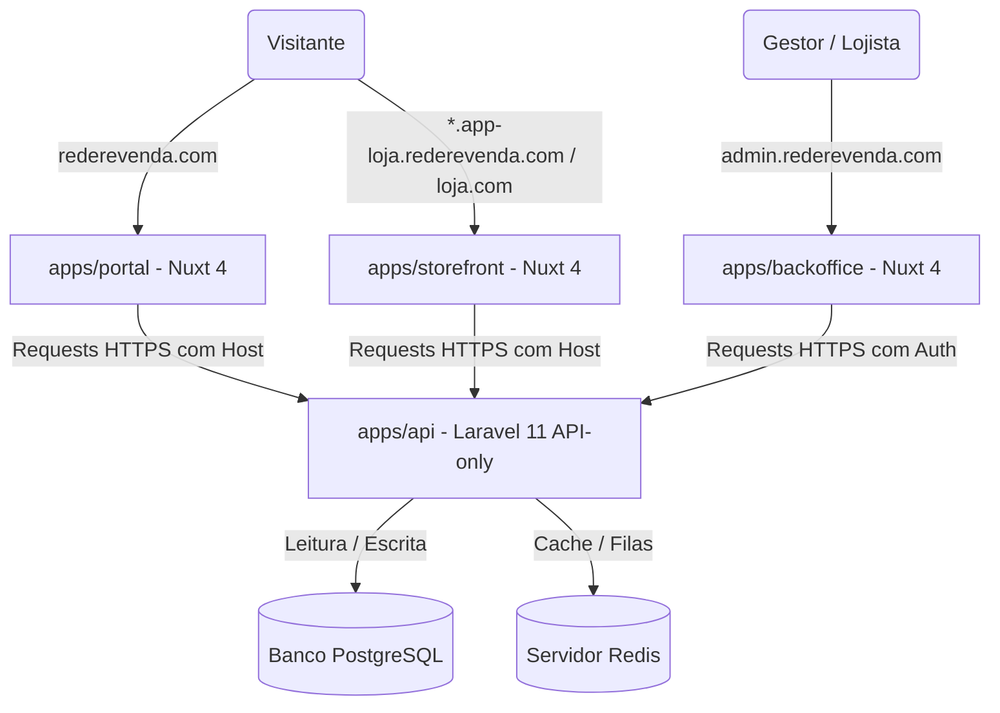
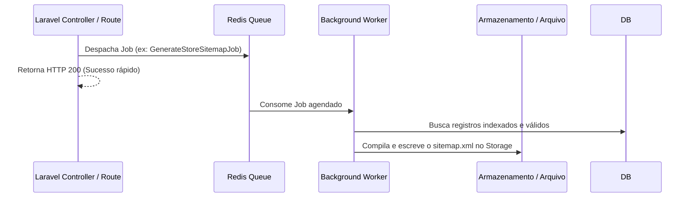

# Arquitetura do Sistema - AutoHub Central

A arquitetura do **AutoHub Central** foi projetada visando modularidade, isolamento de escopo entre aplicações, forte suporte a indexação por mecanismos de busca (SEO) e baixa complexidade operacional no MVP, mantendo uma fundação escalável.

---

## Desenho da Arquitetura Geral

O ecossistema é baseado no modelo de **Back-end centralizado e Front-ends desacoplados (API-first)**:

---

## Isolamento Lógico de Multi-Tenancy

O AutoHub Central adota um modelo de **banco de dados único com isolamento lógico** por coluna. Esta estratégia reduz custos operacionais de infraestrutura e simplifica migrations e manutenção, sendo a ideal para o escopo de MVP.

### Regras de Estruturação:
* **Escopo por ID**: Todas as tabelas operacionais importantes possuem obrigatoriamente a coluna `store_id`.
* **Escopo Global Seguro**: No Laravel API, as operações que envolvem recursos de inquilino (ex: Veículos, Leads, Usuários locais) são isoladas aplicando o escopo global `StoreScope` (ou controladas por policies baseadas no tenant).
* **Isolamento entre Tenants**: Um vendedor ou administrador de uma Loja A nunca terá visibilidade ou capacidade de mutar registros pertencentes à Loja B. Toda request validada sob autenticação de tenant é estritamente filtrada pelo `store_id` associado ao usuário.

---

## Resolução de Inquilinos por Domínio

A aplicação `storefront` funciona como uma camada de visualização universal. Ela não armazena estado das lojas localmente.
1. O storefront recebe um request HTTP contendo o `Host` da requisição (ex: `autocar.app-loja.rederevenda.com` ou `loja-do-pedro.com`).
2. A aplicação storefront encaminha a requisição HTTP para a API Laravel injetando o cabeçalho personalizado `X-Store-Host` com o valor do host original.
3. O middleware `ResolveTenant` intercepta a chamada na API, valida o domínio na tabela `store_domains` e define o escopo lógico da loja ativa (`store_id` ativo no container do Laravel).
4. O middleware carrega e injeta no container do Laravel as configurações específicas da loja correspondente.

---

## Estratégia de Caching no Redis

Para garantir performance e mitigar gargalos de acessos simultâneos ao banco PostgreSQL, o Redis é utilizado de forma estratégica com caches estruturados com TTLs de duração controlada.

### Chaves de Cache Utilizadas:

* **store:domain:{domain}**:
  - Armazena o mapeamento entre o host recebido e a entidade `Store` correspondente (incluindo seu ID e status).
  - TTL: Estendido (ex: 24 horas ou indefinido), sendo invalidado ativamente no momento da alteração de domínios ou criação de loja.
* **store:{store_id}:settings**:
  - Cache dos dados de parametrização da loja (logo, banners, contatos do WhatsApp).
  - TTL: 2 horas, com invalidação no evento de atualização no backoffice.
* **store:{store_id}:featured_vehicles**:
  - Armazena os veículos em destaque que aparecem na home do storefront da loja.
  - TTL: 30 minutos.
* **portal:home**:
  - Cache dos anúncios consolidados e destaques globais da home do marketplace.
  - TTL: 15 minutos.

---

## Orquestração de Filas e Tarefas em Background

Operações que exigem uso computacional denso ou comunicação com terceiros são delegadas para filas do Redis, garantindo resposta imediata na API.

### Principais Tarefas Assíncronas:
* **Geração de Sitemaps**: Jobs individuais geram e gravam os arquivos `.xml` do portal e das lojas diretamente no disco.
* **Processamento de Leads**: Disparo de e-mails, envio de notificações ou webhooks de propostas comerciais.
* **Otimização de Imagens**: Redimensionamento e compactação das fotos enviadas de veículos no momento do cadastro.
