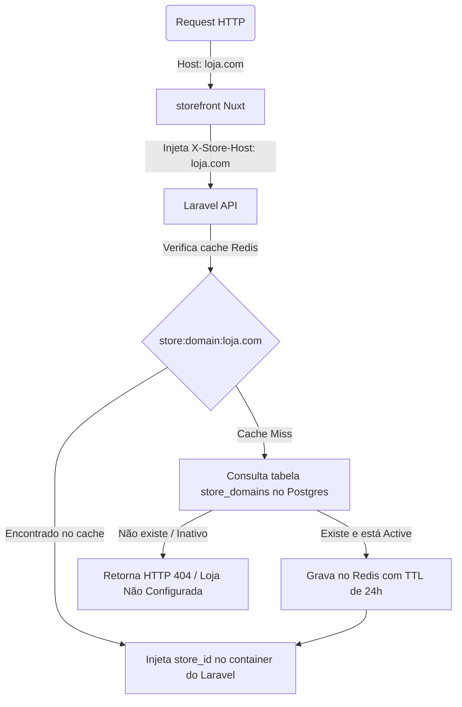

# Domínios e Multi-Tenancy - AutoHub Central

A resolução flexível, robusta e rápida de domínios dinâmicos das revendedoras é a principal engrenagem do ecossistema do **AutoHub Central**. Este documento detalha como as lojas são identificadas a partir de seus domínios e como essa lógica é orquestrada no banco de dados e camadas de cache.

---

## Tipos de Domínio no Ecossistema

Toda loja registrada possui obrigatoriamente um ou mais registros vinculados na tabela `store_domains`. Os domínios classificam-se em dois tipos principais:

### 1. Domínio Interno
Criado de forma automatizada no momento em que o gestor central registra a loja na plataforma. Ele segue o padrão do domínio técnico base configurado no `.env`:
* **Padrão**: `{public_id}.app-loja.rederevenda.com`
* **Regra do `public_id`**: Não numérico, único, amigável ou aleatório (ex: `autocar-pedro-natal-rn`, `abcdefghijkl` ou `rrv-8xk29p`).
* **Estado inicial**: Sempre ativo (`status = active`), verificado (`is_verified = true`) e primário (`is_primary = true`).

### 2. Domínio Customizado
Adicionado posteriormente pelo próprio lojista a partir de seu painel administrativo local (ex: `dominio-custom.com`).
* **Funcionamento de DNS**: O cliente configura uma entrada **CNAME** em sua zona DNS apontando para o seu domínio interno:
  `dominio-custom.com -> CNAME -> autocar-pedro-natal-rn.app-loja.rederevenda.com`
* **Estado inicial**: Criado como pendente (`status = pending`, `is_verified = false`). O sistema executará rotinas periódicas de checagem do apontamento CNAME antes de promovê-lo a ativo.

---

## Modelo de Dados: `store_domains`

O controle absoluto dos domínios é persistido na tabela `store_domains` com os seguintes atributos de controle:

| Coluna | Tipo | Descrição |
| :--- | :--- | :--- |
| `id` | `BigInteger` | Chave primária incremental. |
| `store_id` | `ForeignKey` | Vínculo direto com a tabela `stores` (on delete cascade). |
| `domain` | `String` | Nome único do host consultado (ex: `rrv-8xk29p.app-loja.rederevenda.com`). |
| `type` | `Enum` | Categoria do domínio: `internal` ou `custom`. |
| `is_primary` | `Boolean` | Se este é o endereço padrão de redirecionamento/sitemap da loja. |
| `is_verified` | `Boolean` | Estado de checagem DNS do domínio. |
| `verified_at` | `Timestamp` | Data/hora em que a validação DNS foi concluída. |
| `status` | `Enum` | Status atual da URL: `pending`, `active`, `inactive`, `failed`. |

---

## Fluxo de Resolução de Domínio com Cache em Redis

Toda requisição feita no storefront Nuxt é mapeada ao tenant correto. Veja abaixo o fluxo de consulta otimizado para evitar requisições pesadas ao PostgreSQL:



### Invalidação Proativa de Cache
Sempre que um domínio é mutado no backoffice (criado, verificado, alterado status ou desativado), o Laravel dispara eventos que limpam a chave do Redis associada:
```php
// No Model StoreDomain ou Service de Domínios
Cache::forget("store:domain:{$domain}");
```

---

## Proteção contra Acesso Cruzado entre Lojas

Como todas as lojas compartilham o mesmo banco de dados PostgreSQL e servidor de API central, o sistema aplica um mecanismo de segurança rigoroso:
* **Escopo Global do Tenant**: Em requisições de storefront, as queries de modelos de negócio (ex: `Vehicle::all()`) são automaticamente injetadas com `where('store_id', '=', $resolvedStoreId)`.
* **Políticas de Acesso (Policies)**: No contexto administrativo do lojista, as requisições autenticadas de mutação (criação, edição e exclusão de anúncios) checam se o `store_id` da entidade alvo corresponde exatamente ao `store_id` associado ao usuário logado na tabela `store_users`. Se houver divergência, a API bloqueia a operação imediatamente retornando erro **HTTP 403 Forbidden**.
