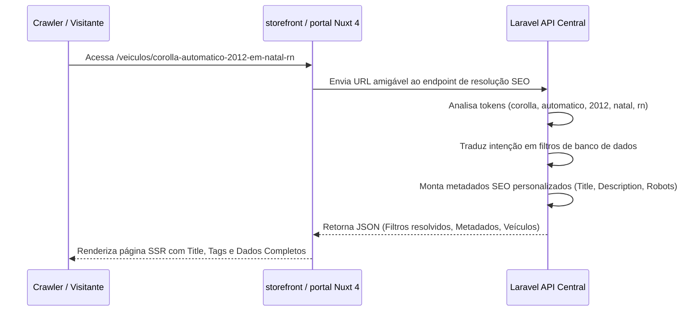

# SEO e Sitemaps - AutoHub Central

A visibilidade orgânica nos mecanismos de busca é fundamental para o sucesso das revendedoras de veículos e do portal central do **AutoHub Central**. Este documento detalha como o sitemap e o ecossistema de SEO são estruturados na API Laravel e expostos nos aplicativos Nuxt.

---

## Geração Assíncrona de Sitemaps via Jobs

A compilação de sitemaps envolve processamento de dados do banco e escrita em disco. Para evitar gargalos de latência HTTP, os sitemaps **nunca são gerados sob demanda no request do usuário**. Eles são processados de forma assíncrona por workers de fila no Redis e salvos como arquivos estáticos `.xml` no diretório público das aplicações.

### Escopos de Geração

O comando Artisan `sitemap:generate` permite flexibilidade total na atualização do sitemap através de argumentos:

* **Gerar Tudo**: Atualiza o sitemap global do portal e os sitemaps individuais de todas as lojas ativas.
  ```bash
  php artisan sitemap:generate --scope=all
  ```
* **Gerar Somente Portal Central**: Atualiza a listagem de páginas institucionais, marcas, modelos e veículos ativos visíveis globalmente.
  ```bash
  php artisan sitemap:generate --scope=portal
  ```
* **Gerar Somente Lojas**: Atualiza os sitemaps de todas as lojas parceiras.
  ```bash
  php artisan sitemap:generate --scope=stores
  ```
* **Gerar Loja Específica**: Força a atualização do sitemap de uma revendedora pelo seu ID.
  ```bash
  php artisan sitemap:generate --store=15
  ```
* **Gerar Lojas Selecionadas**: Atualiza um lote de IDs separados por vírgula.
  ```bash
  php artisan sitemap:generate --stores=15,22,31
  ```

---

## Arquitetura de Fila (Redis Jobs)

O agendador do Laravel dispara jobs específicos que entram na fila Redis:
* **GeneratePortalSitemapJob**: Constrói o sitemap do portal central com listagem de veículos agregados.
* **GenerateStoreSitemapJob**: Recebe o ID de uma loja específica, busca seus veículos ativos, resolve seu domínio primário e gera o arquivo `sitemap.xml` correspondente à URL exclusiva da loja.

---

## Critérios de Qualidade e Segurança (Prevenção de Páginas Vazias)

Para manter a autoridade do ecossistema frente aos crawlers (Googlebot, etc.), o sistema impede de forma proativa a indexação de páginas irrelevantes ou de baixa qualidade:

### 1. Regra de Registros Ativos
Um registro ou URL só é incluído no sitemap se satisfizer cumulativamente:
- A loja associada está com `status = active`.
- O veículo possui `status = published`.
- O domínio está verificado (`is_verified = true` e `status = active`).

### 2. Prevenção de Páginas Vazias
Combinações dinâmicas de busca (ex: `/carros-ate-50000-em-natal-rn`) ou páginas públicas de lojas recém-criadas **não são incluídas nos sitemaps** caso não possuam um volume mínimo aceitável de anúncios (ex: pelo menos 1 veículo ativo correspondente).
Adicionalmente, se uma página de resultado de busca natural estiver vazia, o cabeçalho HTTP da página correspondente no Nuxt renderizará a meta tag `<meta name="robots" content="noindex, follow">` para impedir que os indexadores cataloguem páginas sem conteúdo real.

---

## Rotas Estratégicas de SEO e Interpretação Semântica

O AutoHub Central suporta rotas semânticas amigáveis altamente otimizadas para busca de cauda longa (long-tail keywords).

### 1. Rotas Tradicionais
* **Por cidade/estado**: `/veiculos/sp/sao-paulo`
* **Por marca/modelo em localidade**: `/carros-usados/toyota/rn/natal`
* **Faixas de preço por cidade**: `/carros-ate-80000-em-natal-rn`
* **Tipo/Carroceria por cidade**: `/suvs-em-natal-rn`

### 2. Rotas de Busca Natural
Interpreta termos complexos escritos pelo usuário em URLs amigáveis:
* **Exemplo**: `/veiculos/corolla-automatico-2012-em-natal-rn`

### Divisão de Responsabilidades na Execução:


